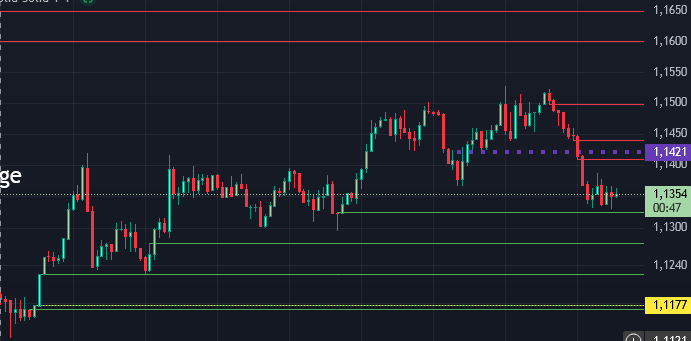

[Github](https://github.com/codexboru/FVG)

# FVG
indikator skript für tradingview Fair Value Gap = FVG script

Tradingview script:

Bullish FVG sowie Bearish FVG
preisziele die früher oder später mindestens einmal angetestet werden.

entry für short sowie entry für longs mit den kurzfristigen preiszielen als ausstieg oder einstieg genutzt werden können.
der script kann nach bedarf geändertwerden von der art der visualisierung von farbe der linien sowie die art der linien.

online link:

[FVG](https://codexboru.github.io/FVG/)
